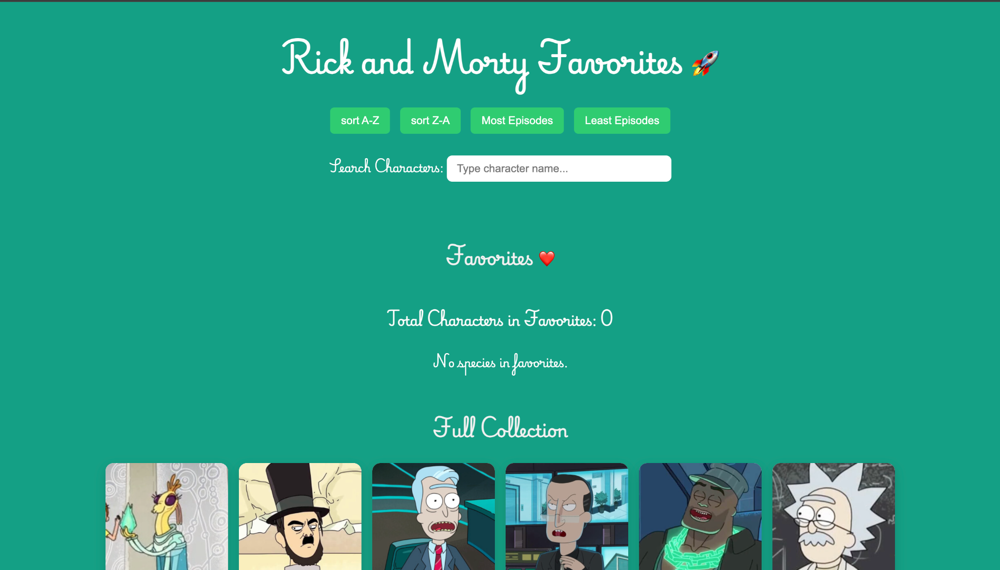

# Rick and Morty Favorites 🚀

A fun web app built with **Vanilla JavaScript** and the [Rick & Morty API](https://rickandmortyapi.com/).  
Browse characters, save your favorites, and get live stats on species distribution.

---

## ✨ Features

- Fetch characters from the Rick & Morty API
- Add/remove favorites with **localStorage persistence**
- Live species summary (per species + total)
- Sort options:
  - **A–Z** / **Z–A**
  - **Most Episodes** / **Least Episodes**
- Debounced search with empty state message
- Loading + error states with retry
- Responsive, lightweight UI

---

## 📸 Screenshot



---

## 🛠️ Tech Stack

- **HTML5**, **CSS3**, **JavaScript (ES6+)**
- Fetch API for data
- LocalStorage for persistence

---

## 🚀 Run Locally

1. Clone this repo:
   ```bash
   git clone https://github.com/YOUR-USERNAME/rick-and-morty-favorites.git
